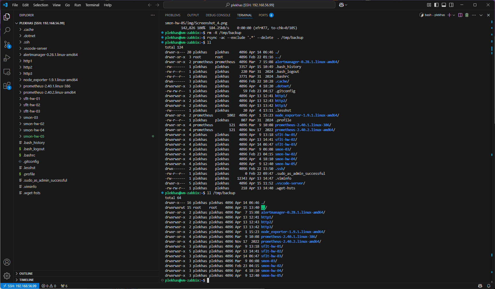
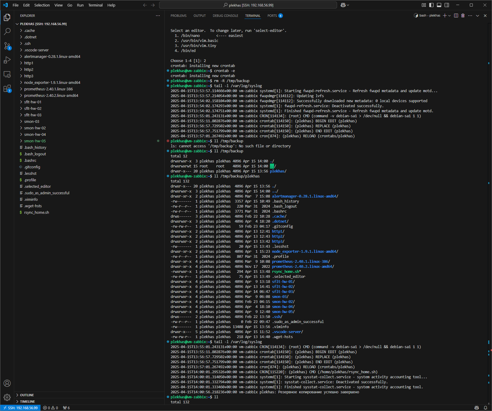
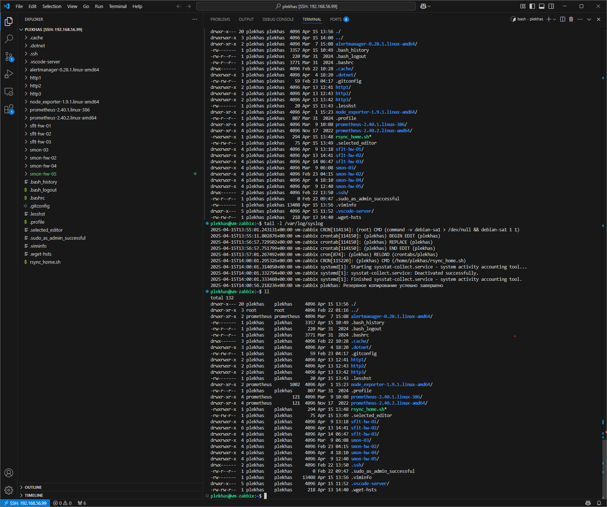

# Домашнее задание к занятию 3 «Резервное копирование» - Плеханов Степан

## Задание 1



## Задание 2

Файл crontab:

````bash
# Edit this file to introduce tasks to be run by cron.
# 
# Each task to run has to be defined through a single line
# indicating with different fields when the task will be run
# and what command to run for the task
# 
# To define the time you can provide concrete values for
# minute (m), hour (h), day of month (dom), month (mon),
# and day of week (dow) or use '*' in these fields (for 'any').
# 
# Notice that tasks will be started based on the cron's system
# daemon's notion of time and timezones.
# 
# Output of the crontab jobs (including errors) is sent through
# email to the user the crontab file belongs to (unless redirected).
# 
# For example, you can run a backup of all your user accounts
# at 5 a.m every week with:
# 0 5 * * 1 tar -zcf /var/backups/home.tgz /home/
# 
# For more information see the manual pages of crontab(5) and cron(8)
# 
# m h  dom mon dow   command
0 14 * * * /home/plekhas/rsync_home.sh
````
Скрипт rsync\_home.sh:

````bash
#!/bin/bash
rsync -ac --delete /home/plekhas /tmp/backup > /dev/null  2>&1

if [ $? -eq 0 ]; then
    logger "Резервное копирование успешно завершено"
else
    logger "Ошибка при выполнении резервного копирования"
fi
````



